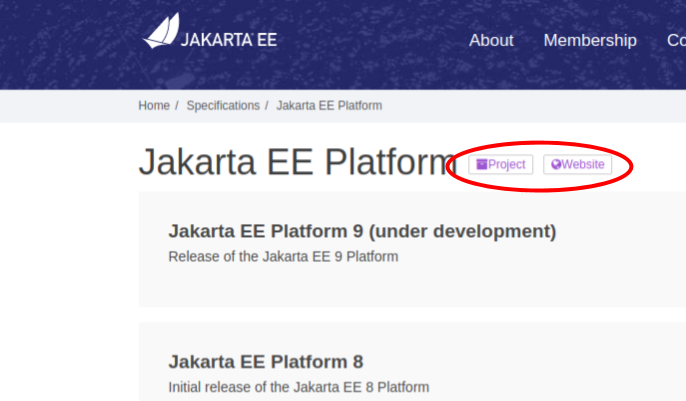
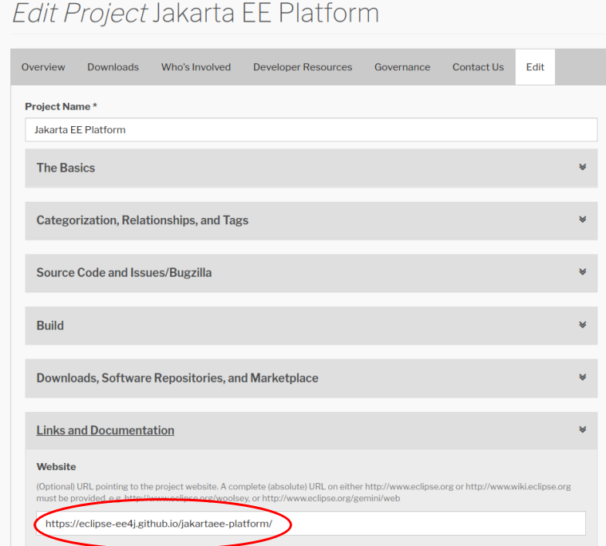

= EE4J PMC Meeting #2020-06

== General

Date: 2020-06-02

Present:

* Kevin Sutter (IBM)
* Mark Little (Red Hat)
* Ed Bratt (Oracle)
* Dmitry Kornilov (Oracle)
* Kenji Kazamura (Fujitsu)
* Steve Millidge (Payara)
* Ivar Grimstad (Eclipse Foundation)

== Set source and target level in parent POM?

See https://github.com/eclipse-ee4j/ee4j/issues/59 

Discussed and agreed to encourage the submitter of the issue to submit a PR.

== Release Qualifiers

Following up the discussions on the mailing list regarding release qualifiers. 
The vote for different formats only resulted in three votes so far.

.The PMC suggests the following format: 
- x.y.z-[Bn|Mn|RCn]
- Upper case, hyphen, no dot after the version number..

Kevin will update the version document.

== Copyright Headers Clarification

This comes up periodically. Example:

A file has the following header

```
Copyright (c) 2009, 2018 Oracle and/or its affiliates. All rights reserved.
```
After it is modified, this is how it should be:
```
Copyright (c) 2009, 2020 Oracle and/or its affiliates and others. All rights reserved.
```

Full description in the Eclipse Development Handbook. +
Ivar will update the wiki if needed.

== EE4J Top Level Web page

Discussed that we lack an easy way to find the various EE4J project’s web sites.

.Specification Projects (Jakarta EE):
- All specifications are listed here: https://jakarta.ee/specifications/
- There is a link to the project producing the specification on each specification page +
  Example:



- The link:https://projects.eclipse.org/projects/ee4j.jakartaee-platform[Project] link points to the Project’s PMI page.
- The link:https://eclipse-ee4j.github.io/jakartaee-platform/[Website] link points to the Project’s website. Will only be displayed if the link is provided by the project in their PMI settings:



.Regular Projects (EE4J):
- All implementation projects are listed on the EE4J PMI page +
  https://projects.eclipse.org/projects/ee4j
- If a project has a website configured (see above), the link is provided under Project Links in the right-menu.

.Decided to:
- Create gh-pages website for EE4J Top Level Project
- Should contain an Index of all project websites (gh-pages or others) for the projects

== Jakarta EE 9 project management

- Milestone release focused on Platform and Web Profile artifacts (Spec, API, TCK, and CI) 
- Individual components (ie. Annotations, or Activation, …) are strongly encouraged to provide PRs for the Specifications repo, but these will not be a requirement for the Milestone release
- These component PRs can include their artifacts in whatever state they think is consumable.  For example, if the Spec is not available yet in pdf or html format, then skip those entries in the _index.md file.  Providing the artifacts via Maven coordinates is also optional at the Component level (they are required at the Platform level).
- These PRs should be very easy to create, review, approve, and merge.  We’re looking for progress, not perfection.  All members of the Spec Committee will need to watch for PRs that need reviewing and approving prior to our June 12 deadline.